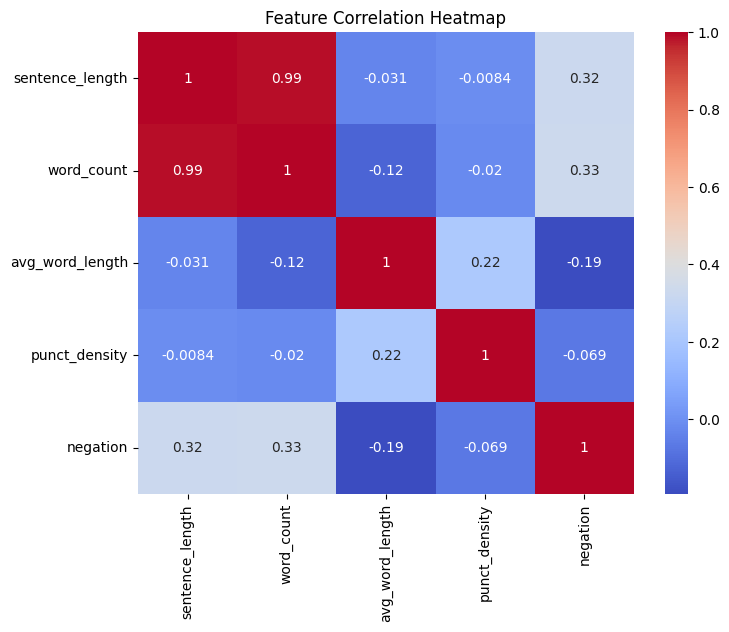
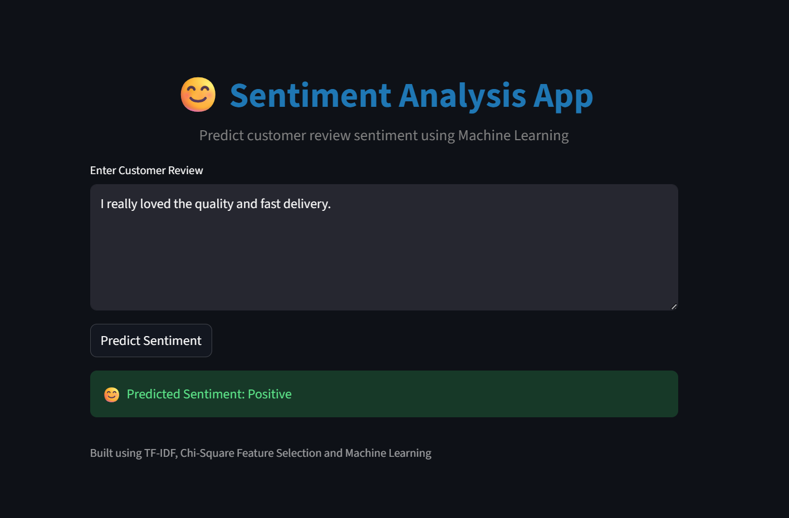
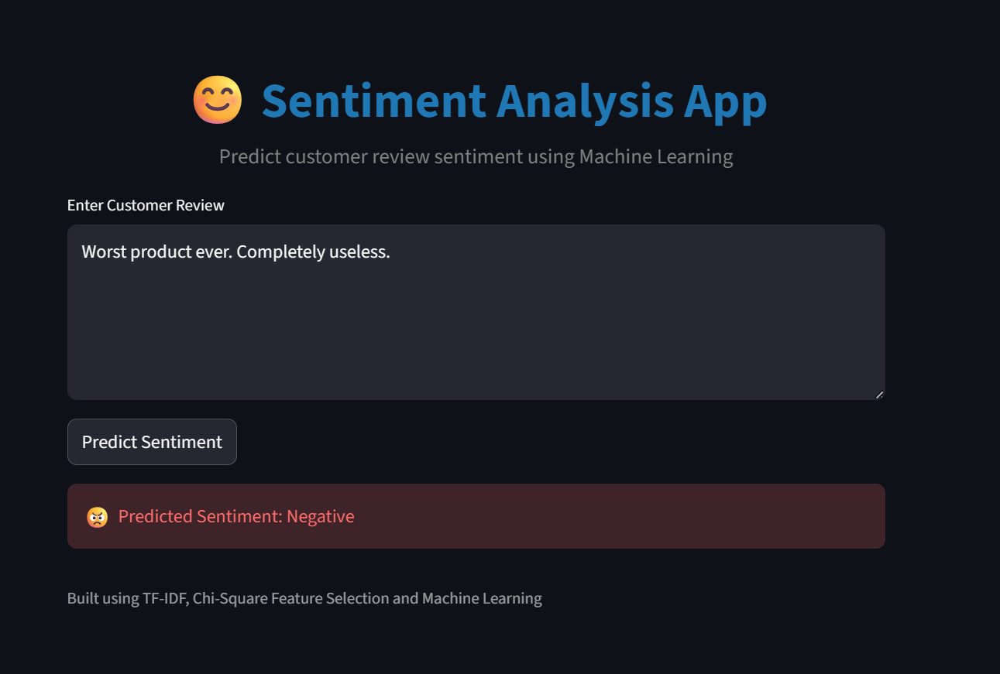
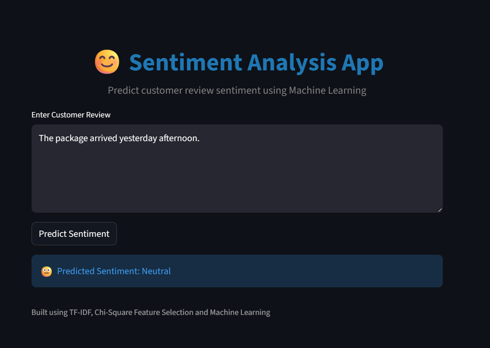

# Sentiment Analysis of Product Reviews Using TF-IDF and ML Classifiers

| Name       | Roll No | Course |
|------------|---------|--------|
| Adithya    | 253314  | GIS    |
| Gayathri   | 253019  | CSDA   |
| Vishnumaya | 253013  | CSDA   |

---

## 🚀 Live Demo

**[▶ Try the App on Streamlit](https://sentiment-analysis-tfidf-ml.streamlit.app/)**

---

## 1. Problem Statement and Motivation

The goal of this project is to classify customer reviews into **Positive**, **Neutral**, and **Negative** sentiments using traditional Machine Learning. Unlike deep learning "black-box" models, this approach focuses on high interpretability and efficiency by combining TF-IDF vectorization with hand-crafted linguistic features. This allows businesses to understand not just what the sentiment is, but which specific linguistic markers (like negation or punctuation) drive customer feedback.

---

## 2. Dataset Description

- **Source:** `Amazon_Reviews.csv` (Scraped Amazon Customer Reviews)
- **Size:** 21,214 records
- **Features:**
  - `Review Text` — Raw textual feedback
  - `Rating` — Star ratings (1–5), mapped to sentiment classes
  - `Linguistic Features` — Sentence length, punctuation density, average word length, and negation presence
- **Class Distribution:**
  - **Negative (Ratings 1–2):** 14,350
  - **Positive (Ratings 4–5):** 5,820
  - **Neutral (Rating 3):** 885

---

## 3. Methodology Overview

1. **Data Cleaning** — Handled `latin1` encoding, removed HTML tags, URLs, and special characters using Regex.
2. **Feature Extraction**
   - **TF-IDF:** Extracted top 5,000 unigrams and bigrams.
   - **Linguistic Metadata:** Engineered custom features — Negation Presence, Punctuation Density, Sentence Length, Average Word Length.
3. **Feature Selection** — Applied **Chi-Square (χ²)** to reduce the feature space to the top **3,000** most significant predictors.
4. **Model Training** — Compared four algorithms: Logistic Regression, Multinomial Naive Bayes, Linear SVM, and Gradient Boosting.
5. **Evaluation** — Prioritized **Macro F1-Score** due to significant class imbalance.

---

## 4. Feature Correlation Heatmap



Key observations:
- `sentence_length` and `word_count` are nearly perfectly correlated (r = 0.99)
- `negation` shows moderate correlation with `word_count` (r = 0.33)
- `avg_word_length` and `punct_density` are largely independent of other features

---

## 5. Results & Evaluation

The **Linear SVM** model provided the best balance across all sentiment classes.

| Model | Macro F1-Score | Global Accuracy |
|:---|:---|:---|
| **Linear SVM** | **0.6235** | **90%** |
| Logistic Regression | 0.6065 | 90% |
| Gradient Boosting | 0.5886 | 86% |
| Multinomial NB | 0.5235 | 79% |

**Top Discriminating Features:**
- **Positive:** *perfect, amazing, excellent, great, love*
- **Negative:** *useless, terrible, horrible, worst, not*

---

## 6. Deployment Results

### 😊 Positive Prediction


### 😠 Negative Prediction


### 😐 Neutral Prediction


---

## 7. Project Structure

```
├── app.py                    # Streamlit application
├── requirement.txt           # Python dependencies
├── sentiment_model.pkl       # Trained Linear SVM model
├── tfidf_vectorizer.pkl      # Fitted TF-IDF vectorizer
├── label_encoder.pkl         # Label encoder
├── chi_selector.pkl          # Chi-Square feature selector
├── Amazon_Reviews.csv        # Dataset
├── heatmap.png               # Feature correlation heatmap
└── deployment_results/
    ├── positive_review.png
    ├── negative_review.png
    └── neutral_review.png
```

---

## 8. How to Run Locally

```bash
# Install dependencies
pip install -r requirement.txt

# Launch the app
streamlit run app.py
```

---

## 9. Built With

- **Scikit-learn** — TF-IDF, Chi-Square, Linear SVM
- **Streamlit** — Web application framework
- **Pandas / NumPy** — Data processing
- **Joblib** — Model serialization
